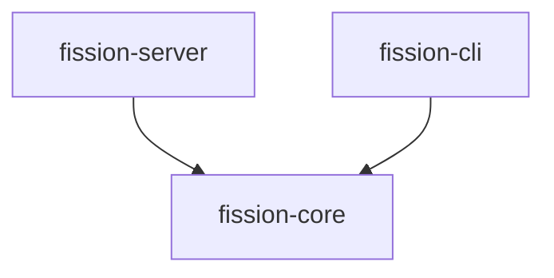

<div align="center">
  <p>
    <a href="https://crates.io/crates/fission-server">
      
    </a>
    <a href="https://codecov.io/gh/fission-codes/fission-server">
      
    </a>
    <a href="https://github.com/fission-codes/fission-server/actions?query=">
      
    </a>
    <a href="https://github.com/fission-codes/fission-server/blob/main/LICENSE">
      
    </a>
    <a href="https://docs.rs/fission-server">
      
    </a>
    <a href="https://fission.codes/discord">
      
    </a>
  </p>
</div>

<div align="center"><sub>⚠️ Work in progress ⚠️</sub></div>

# Fission Server (& CLI)

This repository contains an implementation of the fission webserver, an implementation of a CLI that allows interacting with the webserver.

## Overview

- [Server design documentation](./design/README.md)
- [Server API documentation](./design/api.md)
- [`fission-server`](./fission-server/README.md): Contains the webserver implementation and two binaries, one for running the webserver, one for generating an openAPI document.
- [`fission-cli`](./fission-cli/README.md): Contains the CLI implementation, its binary is the CLI.
- [`fission-core`](./fission-core/README.md): Contains code that can be shared between CLI and server, such as request/response types.

The dependencies between the crates in this workspace look like this:



## Running the Webserver

### Using nix

```sh
nix run . -- --config-path ./fission-server/config/settings.toml
```

### Using pre-installed cargo & postgres

```sh
$ pg_ctl -o '-k /tmp' -D "./.pg" start
$ cargo run -p fission-server -- --config-path ./fission-server/config/settings.toml
```

## Development

You can drop into a development shell, if you have nix installed via

```sh
$ nix develop
```

from the project root.


You can re-build and re-run the webserver on every file change via `cargo watch`:

```sh
$ cargo watch -c -s "cargo run -p fission-server -- -c ./fission-server/config/settings.toml"
```

## Production

In production, you may want to enable the `--no-colors` flag on the executable.

All CLI flags are also available as environment-variables, so `FISSION_SERVER__NO_COLORS=true` and `FISSION_SERVER__CONFIG_PATH="./prod-settings.toml"` or even values from the `settings.toml` file itself. Double underscores are used as a separator between settings keys, because these can contain underscores themselves.

You'll also want to set `server.environment = "prod"` in `settings.toml`, and with that you'll need to provide a valid `mailgun.api_key` (can also be set as the environment variable `FISSION_SERVER__MAILGUN__API_KEY=...`).
