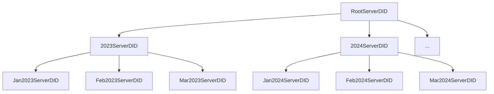
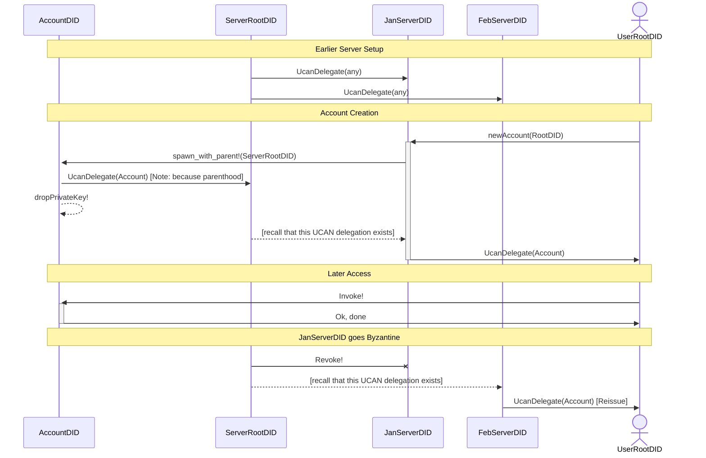
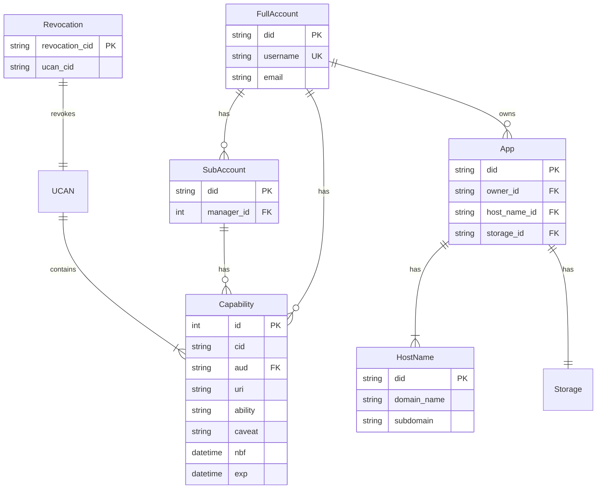

# Software Design Documentation

The Fission Server provides accounts, capabilities, and coordination for various services in the Fission ecosystem.

Use this as the main component for Fission hosted services. These are the ODD set of services, complimenting [ODD SDK](https://odd.dev). Developers are the primary audience, but also early adopters who want an ODD account / "Login with ODD".

Let people who want run a managed namespace of accounts run their own instance of the server. This is likely an app developer with one or more apps and a large user base, or someone that wants to brand "Login with Brand" and accompanying domain names and other settings.

We _may_ support multi-tenant in the future (hosting multiple "Login with Brand" experiences), but we'd rather see other people running instances first and/or have a clear desire for many of these.

# Goals

- Runnable by Fission, or deployed by others (self-hosting)
- Easy to integrate into other backend services (modular, etc)
- Record the information necessary for recovery and contact
- Allow a user to manage a group of other users

## User Stories

This service (currently) only manages accounts. In the future, the following scenarios should be supportable.

### User Archetypes

| Name  | Emoji | Role           | Core Need                                             |
|-------|-------|----------------|-------------------------------------------------------|
| April | 👩🏾‍💻    | App Developer  | Publish & manage apps                                 |
| Terri | 🧑🏼‍💻    | Technical User | Publish files (e.g. backup their Desktop)             |
| Usher | 👨🏽‍🎨    | App User       | Sign up for & use an app published to Fission's infra |

### Web Storage

Terri wants to backup their Desktop, wants to be able to view their data online, and is going to write some tools to sync data between their devices. They open the Fission CLI and sign up for the service with their email, and registers the username `terri`. The server returns a 200 OK and a UCAN enabling their local DID to upload to storage that is accessible to read at (e.g.) `_dnslink.terri.files.fission.name`. They make a CAR Mirror request to upload data to the `terri.files.fission.name` file system (note: this is different from what we have today and is likely a good practice / solves a few edge cases that we've run into).

### App Publishing

April wants to launch an app on Fission's service. She goes to the Fission CLI, and signs up for the service with her email, and registers the username `april2023`. She's prompted to set up a Passkey (which will be her root DID). A WNFS is created, delegates a superuser UCAN to `did:key:zAprilPasskey`. April is prompted to register an app name or use the default (autogenerated `friendly-pink-dragon`), and select a directory that she wants to upload (`./`). The app directory is uploaded via CAR Mirror, and DNSLink at `friendly-pink-dragon.fission.app` is set.

### Managed Homestar FaaS

Terri wants to register a function on Odd Functions. They go to the Fission CLI, and signs up for the service with their email, and registers the username `terri2023`. They're prompted to set up a Passkey (which will be their root DID). The Fission FaaS service then delegates 1000 credits to `did:key:zTerriPasskey`.

# Approach

## Event Sourcing

Instead of recording the `createdAt` and latest `modifiedAt`, the Fission server records immutable events. This stores more data in the database, but has multiple advantages:

- Schema migrations can be reconstituted performed directly or by playing over the log
- Post hoc analysis and debugging is possible
- Nondestructive updates makes fixing bugs in-place significantly easier

## Resource DIDs

In the previous (Haskell) server, the user's DID was registered directly in the (central) database. This approach has a few drawbacks:

- Requires a DB lookup to find the associated owner for an account (or other resource)
- Doesn't provide a solution to uniquely identifying a single resource in a one-to-many relationship
- Has ACL semantics at the final step of the delegation (which is not unheard of in capability modeling)

Instead, if every resource (include the account itself) is uniquely identified by a DID, then UCANs can be used throughout without resorting to an external ownership list. With this approach, the keys for the resource may be stored in a KMS, or ideally _dropped completely_ after delegating root access to one or more controllers. To solve for recovery and a server-controlled revocation fail-safe, a key may be kept offline (i.e. a "cold DID") and delegated to.

Here is one example of such a DID hierarchy:

Here is one such flow, with a cold server DID and monthly hot server DID:

Note that in the revocation case, `RootServerDID` revokes all previous delegations affected by the Byzantine DID. This means that they "should" be re-issued, but the blast radius is contained. If more granularity is desired, the predelegation tree of server agents can be made deeper.

# Entities

# API Endpoints

While the Fission Server may eventually switch to a RPC design, today we use a JSON REST API:

| REST Action | HTTP Verb | Path                               |
|-------------|-----------|------------------------------------|
| Create      | `POST`    | `/v0/api/account`                  |
| Create      | `POST`    | `/v0/api/account/:account_did/sub` |
| Update      | `PUT`     | `/v0/api/did/:did`                 |
| Destroy     | `DELETE`  | `/v0/api/did/:did`                 |

Note that since (most) entities are addressed by a unique DID, dispatch to multiple entity types can be handled with the same endpoint (e.g. for `DELETE`s).

# Accounts

There are two types of Account:

- Full Account / direct relationship
- Sub User / managed by a Verified User

The distinction is roughly "who is the point of contact?" (Fission or one of our other users).

## Full Account

The core of the account system: Full Accounts. These are the people that we have direct relationships with. This anology only goes so far, but it's like setting up a root (AWS) IAM account. As such, we MUST record their username and email. They also get attached Volume storage out of the box.

A Full Account has the following fields:

| Field      | Type     | Role        | Unique | Required |
|------------|----------|-------------|--------|----------|
| `did`      | `String` | Primary Key | Yes    | Yes      |
| `username` | `String` |             | Yes    | Yes      |
| `email`    | `String` |             | No     | Yes      |

## Sub Account

A "Sub User" is an account where the relationship is mediated by a Full User. As such, Fission does not need to keep as much information about them.

This relationship also has knock-on effects, such as billing the Sub Account's usage to the associated Full User's account (once billing is set up).

A Sub Account has the following fields:

| Field                     | Type     | Role        | Unique | Required |
|---------------------------|----------|-------------|--------|----------|
| `did`                     | `String` | Primary Key | Yes    | Yes      |
| `manager_id`[^manager_id] | `String` | Foreign Key | No     | Yes      |

[^manager_id]: Billing requires having this information stored directly in the database. However, control over a subaccount may be granted separately via UCAN. Having UCAN be the main mode of tracking authority is possible, but  This relationship may also be modelled with UCANs and capability store, but we have opted to not do that for reasons of efficient query and ease of enforcing invariants.

# Capabilities

To facilitate UCAN delegation when users are offline, the Fission server adapts some patterns from object capabilities. As new resources are delegated to an account's DID, the relevant UCAN is captured in a cache and indexed. This provides the ability to attach arbitrary capabilities to an account.

In object oriented terms, this means that the account learns about new messages that it can call. From the perspective of the delegated root user, it means that new APIs (or RPC actions) are possibly available dynamically. The capabilities may or _may not_ be exposed to the delegated user ("account owner"), since these may be abstracted away by a server-managed resource ("object"). When delegatable, an endpoint should be available for the delegated user to download from the cache. Clearing this cache is not required except for after expiration or revocation.

The UCAN that contains the capability is kept in binary storage (i.e. an object store). The capability is indexed for lookup performance:

| Field         | Type       | Role        | Unique | Required |
|---------------|------------|-------------|--------|----------|
| `id`          | `Int`      | Primary Key | Yes    | Yes      |
| `cid`         | `String`   |             | No     | Yes      |
| `aud`         | `String`   | Foreign Key | No     | Yes      |
| `uri`         | `String`   |             | No     | Yes      |
| `ability`     | `String`   |             | No     | Yes      |
| `caveat`      | `String`   |             | No     | No       |
| `nbf`         | `DateTime` |             | No     | Yes      |
| `exp`         | `DateTime` |             | No     | Yes      |

## Revocation

Revocation tracking is very useful. A simple revocation store can be modeled as follows:

| Field            | Type       | Role        | Unique | Required |
|------------------|------------|-------------|--------|----------|
| `revocation_cid` | `String`   | Primary Key | Yes    | Yes      |
| `ucan_cid`       | `String`   |             | No     | Yes      |

# Storage

_Storage is not available at time of writing._

When File System storage become available, an association to Accounts should be made:

Storage has the following fields:

| Field         | Type     | Role        | Unique | Required |
|---------------|----------|-------------|--------|----------|
| `did`         | `String` | Primary Key | Yes    | Yes      |
| `root_cid`    | `String` |             | No     | Yes      |
| `quota_bytes` | `Int`    |             | No     | Yes      |
| `used_bytes`  | `Int`    |             | No     | Yes      |

# Host Name

_Domain names are not available at time of writing._

| Field         | Type     | Role        | Unique | Required |
|---------------|----------|-------------|--------|----------|
| `did`         | `String` | Primary Key | Yes    | Yes      |
| `domain_name` | `String` |             | No     | Yes      |
| `subdomain`   | `String` |             | No     | No       |

# App

_Apps are not available at time of writing._

| Field          | Type     | Role        | Unique | Required |
|----------------|----------|-------------|--------|----------|
| `did`          | `String` | Primary Key | Yes    | Yes      |
| `owner_id`     | `String` | Foreign Key | No     | Yes      |
| `host_name_id` | `String` | Foreign Key | Yes    | Yes      |
| `storage_id`     | `String` | Foreign Key | No     | Yes      |

# FAQ

## Eventual Interop

We would like to seamlessly interop with other products and services in our orbit, such as Noosphere, Number0, DAG House, and Bacalhau. Being able to support DIDs generated by them, or transparently have them (e.g.) use us for DNS or us use them for storage would be helpful.

## What About NNS?

Part of the BYOR (bring your own resource) philosophy means that we can take the mutable pointers out of our managed DNS and move them to NNS. Of course NNS also manages things like DIDs, but for pointers to e.g. the latest WNFS, updating in NNS is a good source of truth (it's where the idea originated after all).

How we'd interact with NNS is a whole other question. It's technically a separate system, though we'd run at least one node. Would we run a NNS gateway? Would we poll and update DNS as we track certain records? Would NNS look up records from our DNS? These are questions for when we get closer.

<!-- External Links -->

[DNSLink]: https://dnslink.io/
