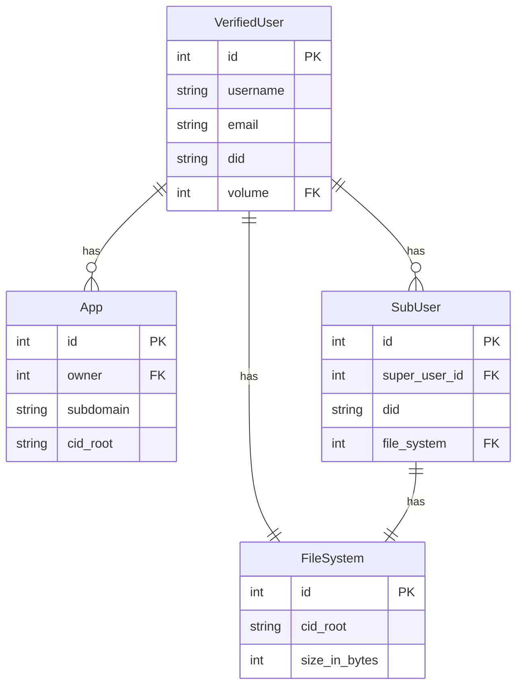

# Software Design Documentation

The Fission Server provides accounts, capabilities, and coordination for various services in the Fission ecosystem.

Use this as the main component for Fission hosted services. These are the ODD set of services, complimenting [ODD SDK](https://odd.dev). Developers are the primary audience, but also early adopters who want an ODD account / "Login with ODD".

Let people who want run a managed namespace of accounts run their own instance of the server. This is likely an app developer with one or more apps and a large user base, or someone that wants to brand "Login with Brand" and accompanying domain names and other settings.

We _may_ support multi-tenant in the future (hosting multiple "Login with Brand" experiences), but we'd rather see other people running instances first and/or have a clear desire for many of these.

# Account Service

## Goals

* Runnable by Fission, or deployed by others (self-hosting)
* Support app-namespaced users in addition to top-level Fission users
* Each user gets a unqiue subdomain out of the box

## Antigoals

* Kitchen sink service
* 

## User Stories

### User Archetypes

| Name  | Emoji | Role           | Core Need                                             |
|-------|-------|----------------|-------------------------------------------------------|
| April | 👩🏾‍💻    | App Developer  | Publish & manage apps                                 |
| Terri | 🧑🏼‍💻    | Technical User | Publish files (e.g. backup their Desktop)             |
| Usher | 👨🏽‍🎨    | App User       | Sign up for & use an app published to Fission's infra |

### Near-Term Web Storage

Terri wants to backup their Desktop, wants to be able to view their data online, and is going to write some tools to sync data between their devices. They open the Fission CLI and sign up for the service with their email, and registers the username `terri`. The server returns a 200 OK and a UCAN enabling their local DID to upload to storage that is accessible to read at (e.g.) `_dnslink.terri.files.fission.name`. They make a CAR Mirror request to upload data to the `terri.files.fission.name` file system (note: this is different from what we have today and is likely a good practice / solves a few edge cases that we've run into).

### Near-Term App Publishing

April wants to launch an app on Fission's service. She goes to the Fission CLI, and signs up for the service with her email, and registers the username `april2023`. She's prompted to set up a Passkey (which will be her root DID). A WNFS is created, delegates a superuser UCAN to `did:key:zAprilPasskey`. April is prompted to register an app name or use the default (autogenerated `friendly-pink-dragon`), and select a directory that she wants to upload (`./`). The app directory is uploaded via CAR Mirror, and DNSLink at `friendly-pink-dragon.fission.app` is set.

### Aspirational FaaS Story

Terri wants to register a function on Odd Functions. They go to the Fission CLI, and signs up for the service with their email, and registers the username `terri2023`. They're prompted to set up a Passkey (which will be their root DID). The Fission FaaS service then delegates 1000 credits to `did:key:zTerriPasskey`.

# Requirements

Users come in two flavours: ~~vanilla and mint~~ Fission users and App users. The distinction is roughly "who is responsible for them?" (us or the app owner).

# ERD

Here is an _extremely loose, very hypothetical_ entity-relationship diagram modelling the database relationships.

## Conventional

### Short Term

### Medium Term

## Radical OCAP Design

If we decide to lean more heavily into UCAN, we can pull some of these relationships out of the database, though keeping them aroudn certainly doesn't hurt in the case of recovery if they lose their UCAN. In this version, each resource gets its own DID, and delegates to the user. I suggest that this be kept as essentially a long term picture in your head as we can slowly make the databse vistigial.

# Fission User

The root of the system: full users. These are the people that we have direction relationships with. This anology only goes so far, but it's like setting up a root (AWS) IAM account. As such, we MUST record their username and email. They also get attached Volume storage out of the box.

Unlike the current database, where this is all handled with database tables, we should explore this with UCAN (though we can still record this relationshiop if we want). For example, in DAG House's "Spaces" concept, the Space is gerated with a keypair, it delegates full control over itself to the user's DID, and deletes its keys. The advantage of this is that you don't have to look up the Space's "owner"; the root of the UCAN chain is the Space's DID. This also gets rid of that ugly polymorphic relationship in the ERD above :wink:

That means we need to capture username and email on sign up or first interaction. Roughly “give me your contact details, and I’ll give you a UCAN to access some storage”. This table probably looks about the same in that case:

# Where We're Going

It can be helpful to understand what's coming down the pipe. I can't emphasize strongly enough how this is not stuff to work on _today_, but having it loaded into everyone's brains is likely helpful for context :)

**Emphasis: this section is all about future stuff**

# FAQ

# Eventing

The Haskell server recorded an immutible log of events. This was a good idea, and made the DB very flexible and you capture a bunch of data that you don't realize would be useful until much later. I would suggest doing this again (some use cases came up on our call as well).

## Interop

We would like to seamlessly interop with other products and services in our orbit, such as Noosphere, Number0, DAG House, and Bacalhau. Being able to support DIDs generated by them, or transparently have them (e.g.) use us for DNS or us use them for storage would be helpful.

## What About NNS?

Part of the BYODUOS philosophy means that we can take the mutible pointers out of our managed DNS and move them to NNS. Of course NNS also manages things like DIDs, but for pointers to e.g. the latest WNFS, updating in NNS is a good source of truth (it's where the idea originated after all).

How we'd interact with NNS is a whole other question. It's technically a separate system, though we'd run at least one node. Would we run a NNS gateway? Would we poll and update DNS as we track certain records? Would NNS look up records from our DNS? These are questions for when we get closer.

## Is there still an aspirational BYODUOS story?

Part of what we want to enable _in the long term_ is the ability to bring your own storage or DNS. For example, you may want to update DNS at a separate provider like Cloudflare. You'll also note that NNS slots in really nicely for lots of related use cases here 😉 This is more "future", but useful for context.

Operationally, when someone sets up an account, we automatically grant them storage and a subdomain. The server itself behaves as if it's in a closed world. The front end SDK can later evolve to plug in other providers, like Cloudflare for DNS if they need to update on chnage. However, with the magic of [DNSLink], the user can very easily map their Cloudflare DNS to their `fission.name` record.

Carol wants to sign up for the Fission service, but is bringing her own DNS (Cloudflare) but wants to still use our storage (not that this could be the opposite where she brings her own storage). She goes through the normal server setup flow (literally nothing changes here). She navigates to her application, and makes a bunch of changes to the data on her Volume. The SDK is configured with Cloudflare as the DNS provider via its plugin architecture, and after the ODD Volume returns successfully, the SDK sends a request to Cloudflare to update her DNSLink there. Cloudflare returns a 200. She loads her app on a second device, and all of her updated data is visible there.

<!-- External Links -->

[DNSLink]: https://dnslink.io/
