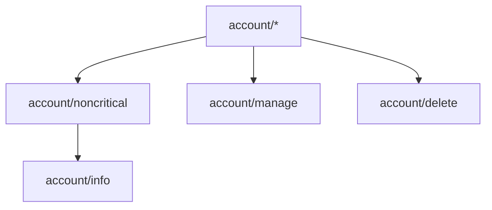

# Fission Server API Specification

## Abstract

This spec describes
- available [server routes](#routes) and which [UCAN] capabilities the these routes expect
- the [set of capabilities](#ucan-capabilities) the server understands and how they can imply each other.


## Routes

Today we use a REST API. In the future we may switch to an RPC-based design. When/if this happens mostly depends on a plan for implementing the UCAN invocation spec.

### POST `/api/v0/auth/email/verify`

---

**Authentication**: *Unauthenticated*

**Request**: `{ email: string }`

**Response**: `{ success: bool }`

---

- Sends an email with a 6-digit verification code to given address
- A hash of the code and email address is stored in a database
- The code expires after 24 hours


### POST `/api/v0/account`

---

**Authentication**:

UCAN giving access to the capability
- with resource `fission:*`
- with ability `account/create` (without caveats)
- originating in `did:key:<device>`.
Its audience must be `did:<server DID>`.

**Request**:
```ts
{
  code: number,
  email: string,
  username: string,
  did: "did:key:<device>",
  credentialID?: string,
}
```

**Response**:

```ts
{ ucans: Array<string> }
```

The response consists of two UCANs:
- ```json
  {
    "iss": "did:key:<account>",
    "aud": "did:<server DID>",
    "cap": { "fission:did:key:<account>": { "*": [{}] } }
  }
  ```
- ```json
  {
    "iss": "did:<server DID>",
    "aud": "did:key:<device>",
    "cap": { "fission:did:key:<account>": { "*": [{}] } }
  }
  ```

---

This request registers a full account given an email verification code and delegates the account's access to given DID. In the future more UCANs may be involved in the delgation chain.


### GET `/api/v0/account/:did`

---

**Authentication**:

UCAN giving access to the capability `"fission:did:key:<account>": { "account/info": [{}] }` originating in `did:key:<account>`.
The UCAN's audience needs to be `did:key:<account>`.

**Response**:

```ts
{
  email: string,
  did: string,
  username: string,
}
```

---

This fetches the latest account information.

### GET `/api/v0/account/:username/did`

---

**Authentication**: *Unauthenticated*

**Response**: `{ did: string }`

---

Use this to find out an account's DID. This information may be substituted by DoH & a DNS record in the future.


### PUT `/api/v0/account/:did/username/:username`

---

**Authentication**:

UCAN giving access to the capability `"fission:did:key:<account>": { "account/manage": [{}] }` originating in `did:key:<account>`.
The UCAN's audience needs to be `did:key:<account>`.

**Response**:

Status 200 OK and `{ success: true }`, if successful.

Status 409 Conflict and `{ success: false }`, if the username is already taken.

---

Change the account's username.


### POST `/api/v0/fetch-capabilities/:did`

---

**Authentication**:

```json
{
  "iss": "did:<from the path>",
  "aud": "did:<server DID>",
  "cap": {}, // Note: Should we introduce a capability? "did:key:zABC": { "capability/fetch": [{}] }?
  "nnc": "<randomly generated>"
}
```

**Request**: `{ ucans: string[] }`

**Response**: `{ ucans: string[] }`

---

This returns a set of UCANs, that, combined with the UCAN from the request body will give the given DID access to new capabilities.

In some cases this can be useful for logging in a new devices. E.g. when passkeys are available and are synced between devices, e.g. it's easy to ask a synced passkey to sign a UCAN giving the `"ucan:*": { "*": [{}] }` capability. However, this UCAN on its own doesn't give the account access to anything yet. It can use this endpoint to fetch the `fission:did:key:<account>` capability UCANs that delegate to the passkey.

In the future this endpoint will be useful for fetching new capabilities from other services that were delegated to a user's account.


## UCAN Capabilities

### Resources

The fission server understands one main resource, which is scoped to the `fission` URL scheme.

Examples:
- `fission:did:key:z6Mkw5d3acoQqn97UjRcGit7J7uWunixxxDKTgkr58CFHLfo`
- `fission:did:key:z6Mkh5xiFmvPkWeHYZYnBLS4jVjsCjtpBS7D4thq1stdyEBK`
- `fission:*`

The URI's path identifies an account by DID. This DID is unique for every account and after delegating rights to the main server DID, the associated private key is deleted.

The `fission:*` scheme subsumes any other resource schemes. It allows you to delegate account capabilities in cases where you don't know the account DIDs (e.g. when they're not generated yet).

### Abilities



#### `account/noncritical` & `account/*`

Abilities on the fission server are grouped into two categories: critical and noncritical abilities.

This destinction allows delegating only non-critical capabilities to a user session, while requiring e.g. a second factor/biometrics for access to any critical capabilities.

This distinction is represented by the `account/noncritical` ability, which subsumes all non-critical capabilities. To delegate access to all capabilities, including criticial capabilities, use `account/*`.

#### `account/create`

Critical. Allows associating the originator of this capability on a newly created account.

#### `account/info`

Non-critical. Allows fetching the associated username/email address or similar information about an account.

#### `account/manage`

Critical. Allows changing the username.

#### `account/delete`

Critical. Allows deleting an account.


[UCAN]: https://github.com/ucan-wg
[design document]: ./README.md
