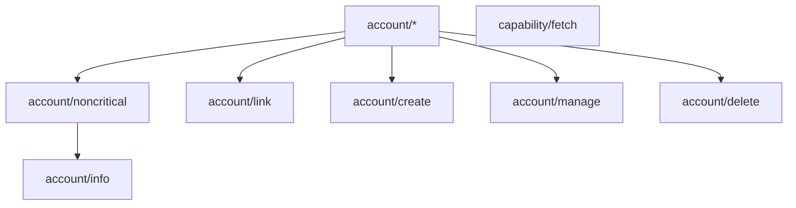

# Fission Server API Specification

## Abstract

This spec describes
- available [server routes](#routes) and which [UCAN] capabilities the these routes expect
- the [set of capabilities](#ucan-capabilities) the server understands and how they can imply each other.

## Routes

Today we use a REST API. In the future we may switch to an RPC-based design. When/if this happens mostly depends on a plan for implementing the UCAN invocation spec.

| Method | Path | Comment |
|--------|------|---------|
| POST | [`/api/v0/auth/email/verify`](#post-apiv0authemailverify) | Trigger email verification |
| POST | [`/api/v0/account`](#post-apiv0account) | Create a full account |
| GET | [`/api/v0/account/:did`](#get-apiv0accountdid) | Get account information by DID |
| POST | [`/api/v0/account/:did/link`](#post-apiv0accountdidlink) | Login from another device via email code |
| PATCH | [`/api/v0/account/username/:username`](#patch-apiv0accountusernameusername) | Change an account's username |
| PATCH | [`/api/v0/account/handle/:handle`](#patch-apiv0accounthandlehandle) | Change the handle that's associated with an account |
| DELETE | [`/api/v0/account/handle`](#delete-apiv0accounthandle) | Disassociate an account's handle |
| DELETE | [`/api/v0/account`](#delete-apiv0account) | Delete an account |
| GET | [`/dns-query`](#get-dns-query) | Perform a DNS-over-HTTPS request |
| GET | [`/api/v0/capabilities`](#get-apiv0capabilities) | Get capabilities for a given account |
| POST | [`/api/v0/revocations`](#post-apiv0revocations) | Revoke a UCAN |

A note on authorization:

For all UCANs that are sent to the server for authorization, following things must hold:
- All capability resources need to be DID URIs.
- A UCAN with a resource DID that's not equal to its issuer DID needs a valid proof chain to a UCAN where this condition holds.
- The final link in the UCAN chain needs to have the server DID as the audience.

These conditions won't be repeated in the route-specific authorization sections.

---

### POST `/api/v0/auth/email/verify`

- Sends an email with a 6-digit verification code to given address
- A hash of the code and email address is stored in a database
- The code expires after 24 hours
- Codes will be deleted when used

**Authorization**: Unauthorized

**Request**:

| Field | Type | Comment |
|-------|------|---------|
| `email` | `string` | The email to send the verification code to |

**Response**:

| Field | Type | Comment |
|-------|------|---------|
| `success` | `bool` | True if sending the email was successful |

---

### POST `/api/v0/account`

Registers a full account given an email verification code and delegates the account's access to given DID. In the future more UCANs may be involved in the delgation chain in the response.

**Authorization**: UCAN with ability `account/create`. The resource DID will be the audience for returned UCANs.

**Request**:

| Field | Type | Comment |
|-------|------|---------|
| `code` | `string` | The code from the verification email |
| `email` | `string` | |
| `username` | `string` | |
| `credentialID` | `string` | Optional. If present, this may be useful for better passkey UX. |

**Response**:

| Field | Type | Comment |
|-------|------|---------|
| `ucans` | `Array<string>` | A set of UCAN delegations that delegate the account's unique DID to the resource DID from the request authorization. |

---

### GET `/api/v0/account/:did`

Fetches the latest account information.

**Authorization**: UCAN giving access to the ability `account/info` with the account's DID as resource.

**Request**: *Empty*

**Response**:

| Field      | Type     |
|------------|----------|
| `email`    | `string` |
| `did`      | `string` |
| `username` | `string` |

---

### POST `/api/v0/account/:did/link`

Get a UCAN for a DID that hasn't been associated with this account yet, given an email verification code.

**Authorization**: *Unauthencitaced*

**Request**:

| Field | Type | Comment |
|-------|------|---------|
| `code` | `string` | The code from the verification email |
| `credentialID` | `string` | Optional. If present, this may be useful for better passkey UX. |

**Response**:

| Field | Type | Comment |
|-------|------|---------|
| `ucans` | `Array<string>` | A set of UCAN delegations that delegate the account's unique DID to the resource DID from the request authorization. |

---

### PATCH `/api/v0/account/username/:username`

Change the account's username. The account DID to change is determined by the resource DID in the authorization UCAN.

**Authorization**: UCAN with ability `account/manage`.

**Response**:

Status 200 OK and `{ success: true }`, if successful.

Status 409 Conflict and `{ success: false }`, if the username is already taken.

---

### PATCH `/api/v0/account/handle/:handle`

Associate a domain name with an existing account. This will function as the username for the account in the future.

**Authorization**: UCAN with ability `account/manage`.

**Response**:

Status 200 OK and `{ success: true }`, if successful.

Status 409 Conflict and `{ success: false }`, if the username is already taken.

---

### DELETE `/api/v0/account/handle`

Disassociate a handle from an existing account. It won't be returned as the canoncial username in get account queries anymore.

**Authorization**: UCAN with ability `account/manage`.

**Response**:

Status 200 OK and `{ success: true }`, if successful.

---

### DELETE `/api/v0/account`

Delete an account.

**Authorization**: UCAN with ability `account/manage`.

**Response**:

Status 200 OK and `{ success: true }`, if successful.

---

### GET `/dns-query`

Perform a DNS-over-HTTPS query.
The server stores user DIDs as DNS TXT records under `_did.username.<user-domain>` and users can associate their own handle with their account by creating their own DNS TXT `_did` record under their domain, set to the account DID they control.

This works similar to [google](google-doh) and [cloudflare](cloudflare-doh) DoH APIs.

Examples:
- `GET /dns-query?name=_did.everywhere.computer&type=TXT`
- `GET /dns-query?name=_did.some-user.e9c7.name&type=TXT`
- `GET /dns-query?name=_did.matheus23.com&type=TXT`
- `POST /dns-query?dns=<base64url encoded dns query message>`

**Authorization**: *Unauthorized*

**Response**:

You need to set either the `Accept: application/dns-json` or `Accept: application/dns-message` header. Depending on that, you'll either get a DNS message encoded in json or in binary, respecively.

---

### GET `/api/v0/capabilities`

This returns the set of UCANs in UCAN chains that have the authorization UCAN's resource DID as final audience.

This way agents can discover new capabilities, or make use of the server as persistent storage for their UCANs, e.g. when their storage gets wiped, but they manage to keep or recover their DID.

In some cases this can be useful for logging in a new devices. E.g. when passkeys are available and are synced between devices, e.g. it's easy to ask a synced passkey to sign a UCAN giving the `"ucan:*": { "*": [{}] }` capability. However, this UCAN on its own doesn't give the account access to anything yet. It can use this endpoint to fetch the `"did:key:<account>": { "*": [{}] }` capability UCANs that delegate to the passkey.

In the future this endpoint will be useful for fetching new capabilities from other services that were delegated to a user's account.

**Authorization**: UCAN with ability `capability/fetch`.

**Response**:

| Field | Type | Comment |
|-------|------|---------|
| `ucans` | `Map<string, string>` | A map of ucans keyed by their canonical CID, giving the DID from the resource in the authorization capabilities. |
| `revoked` | `Array<string>` | The subset of canonical CIDs of UCANs from `ucans` that have been revoked. |

---

### POST `/api/v0/revocations`

Revokes a UCAN via a revocation record. The request body format is specified in the UCAN 0.10 specification, see the section on [revocation validation].

**Authorization**: The UCAN to be revoked together with any proofs, proving that the

**Request**:

| Field | Type | Comment |
|-------|------|---------|
| `revoke` | `string` | The canonical CID of the UCAN to be revoked (must match the UCAN given in the authorization). |
| `iss` | `string` | The DID of who is revoking |
| `challenge` | `string` | A base64unpadded-encoded signature over a challenge to prove the revocation intent |

**Response**:

| Field | Type | Comment |
|-------|------|---------|
| `success` | `bool` | True if revocation was successful |

## UCAN Capabilities

### Resources

Anticipating the upcoming changes to the UCAN spec, where each capability is associated with a "subject" that's *always a DID*, resources for the fission server are also always DIDs.

Examples:
- `did:key:z6Mkw5d3acoQqn97UjRcGit7J7uWunixxxDKTgkr58CFHLfo`
- `did:key:z6Mkh5xiFmvPkWeHYZYnBLS4jVjsCjtpBS7D4thq1stdyEBK`

Often, these DIDs represent an identifier that is unique for every account and after delegating rights to the main server DID, the associated private key is deleted.

Sometimes, these DIDs are generated by clients and represent one of their devices.

### Abilities

#### `account/noncritical` & `account/*`

Account abilities on the fission server are grouped into two categories: critical and non-critical.

This destinction allows delegating only non-critical capabilities to a user session, while requiring e.g. a second factor/biometrics for access to any critical capabilities.

This distinction is represented by the `account/noncritical` ability, which subsumes all non-critical capabilities. To delegate access to all capabilities, including criticial capabilities, use `account/*`.

#### `account/create`

Critical. Allows associating the originator of this capability on a newly created account.

#### `account/link`

Critical. Allows associating the originator of this capability to an existing account via email challenge.

#### `account/info`

Non-critical. Allows fetching the associated username/email address or similar information about an account.

#### `account/manage`

Critical. Allows changing the username.

#### `account/delete`

Critical. Allows deleting an account.

#### `capability/fetch`

Allows finding UCANs known to the server to give capabilities to the associated resource DID.

[UCAN]: https://github.com/ucan-wg
[design document]: ./README.md
[revocation validation]: https://github.com/ucan-wg/spec/tree/16ee2ce7815c60a0ea870283d3b53ddcb3043c02#66-revocation
[google-doh]: https://developers.google.com/speed/public-dns/docs/doh/json
[cloudflare-doh]: https://developers.cloudflare.com/1.1.1.1/encryption/dns-over-https/make-api-requests/
