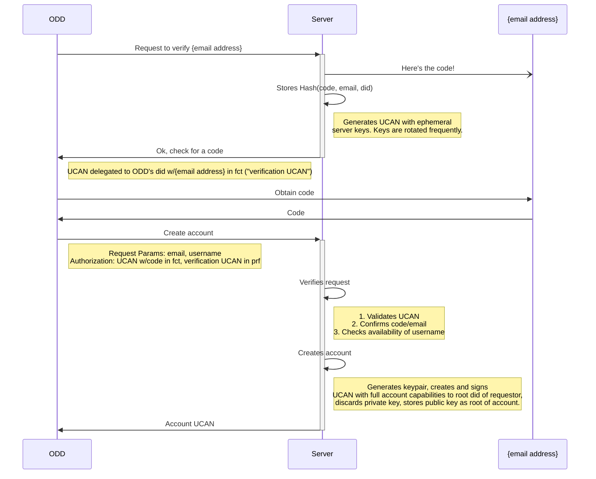

Account Creation Flow

```mermaid
sequenceDiagram
    ODD->>+Server: Request to verify {email address}
    Server-){email address}: Here's the code!
    Server->>Server: Stores Hash(code, email, did)
    Note right of Server: Generates UCAN with ephemeral<br/>server keys. Keys are rotated frequently.
    Server->>-ODD: Ok, check for a code
    Note right of ODD: UCAN delegated to ODD's did w/{email address} in fct ("verification UCAN")

    ODD->>{email address}: Obtain code
    {email address}->>ODD: Code

    ODD->>+Server: Create account
    Note right of ODD: Request Params: email, username<br/>Authorization: UCAN w/code in fct, verification UCAN in prf

    Server->>Server: Verifies request
    Note right of Server: 1. Validates UCAN<br/>2. Confirms code/email<br/>3. Checks availability of username

    Server->>Server: Creates account
    Note right of Server: Generates keypair, creates and signs<br/>UCAN with full account capabilities to root did of requestor, <br/>discards private key, stores public key as root of account.

    Server->>-ODD: Account UCAN
```
